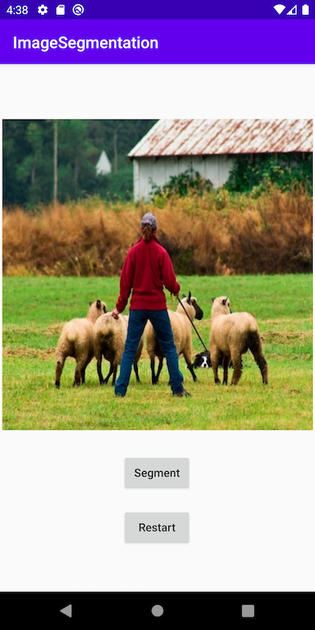
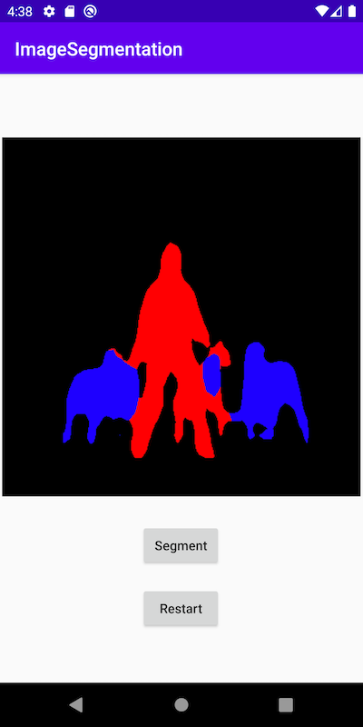

# Semantic Image Segmentation DeepLabV3 on Android

## Introduction

This repo offers a Python script that converts the [PyTorch DeepLabV3 model](https://pytorch.org/hub/pytorch_vision_deeplabv3_resnet101) for mobile apps and an Android app that uses the model to segment images.

## Quick Start

To Test Run the Image Segmentation Android App, follow the steps below:

### 1. Prepare the Model

Open a terminal window, run the following commands:

```
git clone https://github.com/pytorch/android-demo-app
cd android-demo-app/ImageSegmentation
python deeplabv3.py
```

The Python script `deeplabv3.py` is used to generate the TorchScript-formatted model for mobile apps. If you don't have the PyTorch environment set up to run the script, you can download the model file to the `android-demo-app/ImageSegmentation` folder using the link [here](https://drive.google.com/file/d/17KeE6mKo67l14XxTl8a-NbtqwAvduVZG/view?usp=sharing).

Then run `mv deeplabv3_scripted.pt ImageSegmentation` to move the model file to the right location.

### 2. Use Android Studio

Open the ImageSegmentation project using Android Studio.

### 3. Run the app
Select an Android emulator or device and build and run the app. The example image and its segmented result are as follows:

results are:




Note that the example image used in the repo is pretty large (400x400) so the segmentation process may take about 10 seconds. You may use an image of smaller size but the segmentation result may be less accurate.

## Tutorial

Read the tutorial [here](https://pytorch.org/tutorials/beginner/deeplabv3_on_android.html) for detailed step-by-step instructions of how to prepare and run the [PyTorch DeepLabV3 model](https://pytorch.org/hub/pytorch_vision_deeplabv3_resnet101) on Android, as well as practical tips on how to successfully use a pre-trained PyTorch model on Android and avoid common pitfalls.
