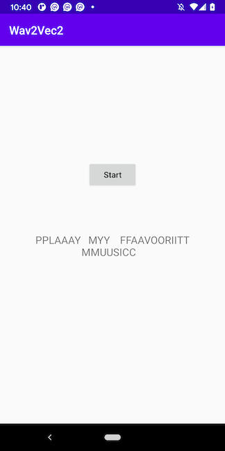

# Speech Recognition on Android with Wav2Vec2

## Introduction

Facebook AI's [wav2vec 2.0](https://github.com/pytorch/fairseq/tree/master/examples/wav2vec) is one of the leading models in speech recognition. It is also available in the [Huggingface Transformers](https://github.com/huggingface/transformers) library, which is also used in another PyTorch Android demo app for [Question Answering](https://github.com/pytorch/android-demo-app/tree/master/QuestionAnswering).

In this demo app, we'll show how to quantize and convert the wav2vec2 model to TorchScript and how to use the scripted model on an Android demo app to perform speech recognition.

## Prerequisites

* PyTorch 1.9 (Optional)
* Python 3.8 (Optional)
* Android Pytorch library 1.9
* Android Studio 4.0.1 or later

## Quick Start

### 1. Prepare the Model

If you don't have PyTorch installed or want to have a quick try of the demo app, you can download the quantized scripted wav2vec2 model  [here](https://drive.google.com/file/d/1wW6qs-OR76usbBXvEyqUH_mRqa0ShMfT/view?usp=sharing), then copy it to the `app/src/main/assets`  folder inside  `android-demo-app/SpeechRecognition`, and continue to Step 2.

With PyTorch 1.9 and torchaudio 0.9 installed, run the following commands on a Terminal:
```
git clone https://github.com/pytorch/android-demo-app
cd android-demo-app/SpeechRecognition
python create_wav2vec2.py
```
This will create the model file `wav2vec2.pt`. Copy it to the Android app:
```
cd ../android-demo-app/SpeechRecognition
mkdir -p app/src/main/assets
cp ../../audio/wav2vec2.pt app/src/main/assets
```

### 2. Build and run with Android Studio

Start Android Studio, open the project located in `android-demo-app/SpeechRecognition`, build and run the app on an Android device. After the app runs, tap the Start button and start saying something; after 6 seconds, the model will infer to recognize your speech. Only basic decoding of the recognition result from an array of floating numbers of logits to a list of tokens is provided in this demo app, but it is easy to see, without further post-processing, whether the model can recognize your utterances. Some example recognition results are:



